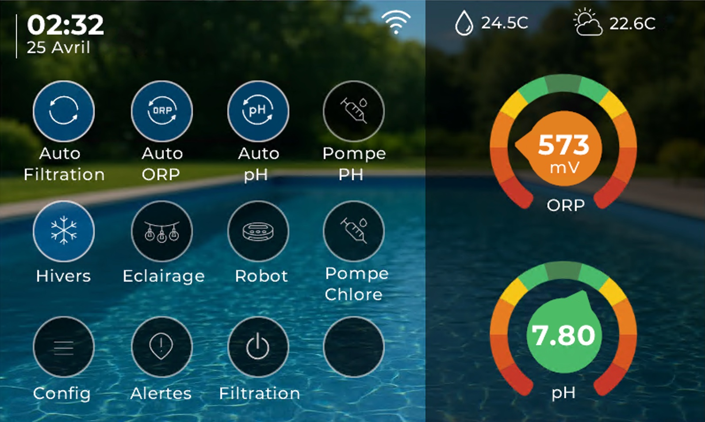
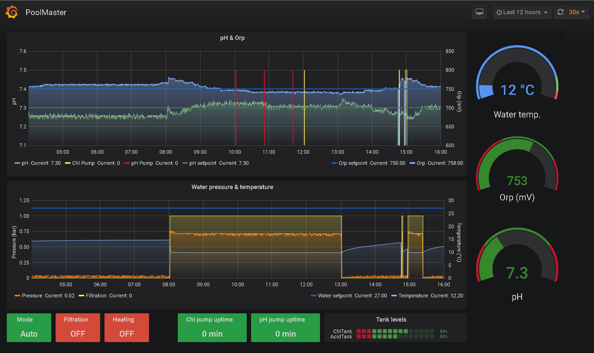

# flow.io

<p align="center">
  
</p>

flow.io est une plateforme autonome de gestion de piscine: elle automatise la qualité de l'eau, le fonctionnement des équipements et la supervision locale ou distante.

Ce dépôt est spécialisé pour une seule cible matérielle et une seule cible de build: `Flowio-waveshare-esp32-s3`. Il ne contient aucun environnement de simulation ni firmware pour une autre carte.

## Matériel de référence: Waveshare et carte Companion

### Contrôleur Waveshare ESP32-S3

Le contrôleur principal est le module industriel **Waveshare ESP32-S3-POE-ETH-8DI-8RO**, piloté par l'environnement PlatformIO `Flowio-waveshare-esp32-s3`.

<p align="center">
  
</p>

<p align="center">
  <a href="https://www.waveshare.com/esp32-s3-eth-8di-8ro.htm">Waveshare ESP32-S3-POE-ETH-8DI-8RO</a> — 8 entrées digitales isolées, 8 relais, Ethernet W5500, Wi-Fi/BLE et RS485.
</p>

Le profil réunit sur un même ESP32-S3 la logique piscine, les entrées/sorties, Ethernet et Wi-Fi, le provisioning, l'interface web, MQTT, Home Assistant, les mises à jour et l'interface HMI. Il exploite aussi le RTC, le buzzer, la LED RGB, deux bus 1-Wire et un bus I2C d'extension.

### Carte flow.io Companion

La carte **flow.io Companion** complète le module Waveshare pour constituer un ensemble de raccordement intégré destiné à la piscine.

<p align="center">
  
</p>

Une nappe dédiée raccorde directement le connecteur d'extension du Waveshare à la carte Companion. Elle reporte les signaux utiles sur des borniers et connecteurs identifiés par fonction afin de présenter clairement les ports piscine et de faciliter le branchement des modules:

- sondes pH, ORP et pression d'eau;
- températures d'eau et d'air;
- niveaux du bassin et des cuves de traitement;
- compteur d'eau et entrées digitales Waveshare;
- extensions I2C, afficheur Nextion et connecteurs internes;
- alimentations et points de raccordement adaptés aux modules intégrés.

Le Waveshare reste le contrôleur qui exécute le firmware; la Companion organise et distribue son câblage. Elle évite les liaisons fil à fil dispersées et permet de monter les modules piscine de manière plus lisible, compacte et maintenable.

Le logiciel conserve trois niveaux indépendants du format physique de la Companion:

| Niveau | Rôle | Exemple |
|---|---|---|
| `domain_slot` | besoin métier piscine | `ActuatorFiltrationPump` |
| `io_slot` | endpoint logique stable | `d00` |
| `binding_port` | ressource physique sélectionnée | `300` / `EXIO1` |

La chaîne complète est `domain_slot -> io_slot -> binding_port`. La [cartographie Waveshare](docs/core/waveshare-io-map.md) inventorie tous les ports, slots et bindings par défaut.

### Compiler le firmware principal

Prérequis: [PlatformIO Core](https://docs.platformio.org/en/latest/core/installation/index.html). Les dépendances déclarées dans `platformio.ini` sont installées automatiquement au premier build.

```sh
~/.platformio/penv/bin/pio run -e Flowio-waveshare-esp32-s3
~/.platformio/penv/bin/pio run -e Flowio-waveshare-esp32-s3 -t upload
```

Le Wi-Fi et MQTT ne contiennent aucun identifiant dans le code source. Leur configuration initiale doit être fournie via le portail de provisioning ou l'interface de configuration; les valeurs sont ensuite stockées en NVS.

La description matérielle de référence est centralisée dans `src/Board/WaveshareBoard.h` (GPIO, UART, I2C, 1-Wire, W5500, buzzer, TFT et capacités statiques). Les bindings fonctionnels restent dans `src/Profiles/Waveshare/WaveshareIoLayout.h`.

- [Mise en service du profil Waveshare](docs/integration/mise-en-service.md)
- [Cartographie complète des binding ports, IO slots et domain slots](docs/core/waveshare-io-map.md)
- [Documentation technique](docs/README.md)

## Pourquoi flow.io

Sans orchestration continue, on observe vite:
- dérive pH / ORP
- filtration mal dimensionnée par rapport à la température
- surconsommation de produits et d'énergie
- usure prématurée des pompes et actionneurs
- gestion complexe de l'hivernage

flow.io apporte un pilotage cohérent de bout en bout.


## Surveillance et contrôle en continu

flow.io mesure l'état du bassin et pilote les équipements en continu pour maintenir l'eau stable, adapter la filtration et sécuriser les traitements.

Modes de désinfection supportés:
- `Chlore/Brome`: régulation PID temporelle sur sonde ORP, avec injection par pompe péristaltique, consigne redox, délai de stabilisation après démarrage filtration, sécurité pression et contrôle du niveau de cuve
- `Electrolyse`: pilotage d'un électrolyseur au sel, soit en suivi de consigne ORP avec hystérésis, soit sur plages fixes pendant la filtration, avec température minimale de sécurité et temporisation de démarrage
- `Oxygène actif liquide`: dosage volumétrique sans asservissement ORP, calculé à partir du volume du bassin, de la dose produit hebdomadaire, du facteur de charge, de la compensation température optionnelle, de l'heure principale de dosage et d'un fractionnement en 1, 2 ou 3 injections par semaine

Régulation automatique de température:
- consigne de chauffage avec hystérésis et relais chauffage dédié
- protocole de chauffage assisté qui lance d'abord la filtration pour obtenir une mesure fiable de température d'eau, puis décide de maintenir pompe et chauffage actifs
- cycles de sondage périodiques lorsque la pompe est arrêtée, avec arrêt automatique une fois la consigne atteinte
- blocage de sécurité si la pression ou la mesure de température ne sont pas cohérentes

Mesures effectuées:
- température de l'eau et de l'air
- pression de pompe
- pH
- ORP / redox
- niveau du bassin
- niveaux de cuves pH et désinfection
- compteur d'eau ou métriques de remplissage
- états, temps de marche, volumes injectés et historiques d'exploitation des équipements

Actionneurs supportés:
- pompe de filtration
- pompe doseuse pH, compatible pH- ou pH+
- pompe doseuse chlore/brome ou oxygène actif liquide
- électrolyseur au sel
- pompe robot
- pompe ou électrovanne de remplissage
- chauffage ou pompe à chaleur
- éclairage et relais auxiliaires

## Interface locale tactile

L'interface locale tactile offre une vue synthétique des mesures, états et commandes principales pour l'exploitation quotidienne au bord du bassin.



## Automatisation utile au quotidien

- calcul automatique de la fenêtre de filtration selon la température d'eau
- priorisation et interlock des actionneurs pour une sécurité totale
- gestion des plannings (jour/semaine/mois) persistante
- modes d'exploitation (auto, manuel, protection gel)
- supervision alarmes (pression, états critiques)

## Principe de régulation PID (pH / ORP)

flow.io implémente une régulation PID temporelle pour les pompes péristaltiques pH et ORP:
- calcul PID périodique (par défaut toutes les `30 s`)
- conversion de la sortie en durée d'activation `output_on_ms` bornée dans une fenêtre fixe (`window_ms`, typiquement `1 h`)
- commande ON/OFF dans la fenêtre: la pompe est active en début de fenêtre pendant `output_on_ms`

Si les conditions de sécurité ne sont pas réunies (filtration arrêtée, mode hiver, capteur indisponible, défaut pression, etc.), la sortie est remise à `0` et la pompe est coupée.

Détail complet de l'algorithme, des conditions d'activation et des topics runtime dans la documentation module:
- [PoolLogicModule](docs/modules/PoolLogicModule.md)

## Intégration et exploitation

- publication MQTT structurée (`cfg/*`, `rt/*`, `cmd`, `ack`)
- auto-discovery Home Assistant pour le contrôle sur Internet et les statistiques à long terme
- gestion via application mobile entièrement paramétrable (Home Assistant)
- intégration possible avec Jeedom/Node-RED/InfluxDB/Grafana via MQTT
- architecture modulaire robuste (FreeRTOS + services Core + EventBus + DataStore + ConfigStore/NVS)
- Mises en jour OTA en Wi-Fi

Résultat: une eau plus stable, une maintenance plus prévisible et une meilleure maîtrise des coûts d'exploitation.



## Documentation développeur

La documentation complète (architecture, services Core, flux EventBus/DataStore/MQTT, et fiche détaillée par module) est disponible ici:

- [Documentation complète](docs/README.md)
- [Quality Gates Modules (notes + description des 10 points)](docs/core/module-quality-gates.md)

## Créer le nouveau dépôt Git

Cette arborescence ne contient pas de dossier `.git`. Depuis le dossier copié:

```sh
git init
git add .
git commit -m "Initial Flow.IO Waveshare ESP32-S3 codebase"
```

Créez ensuite le dépôt distant de votre choix, ajoutez-le comme `origin`, puis poussez la branche initiale. Les répertoires `.pio/`, `binary/`, `data/wc/` et les autres sorties générées sont exclus par `.gitignore`.
