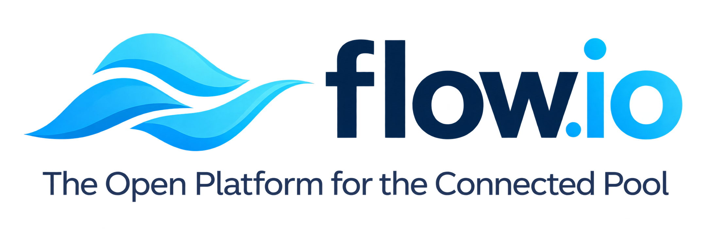
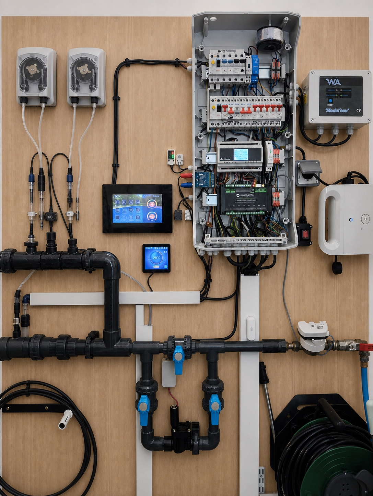
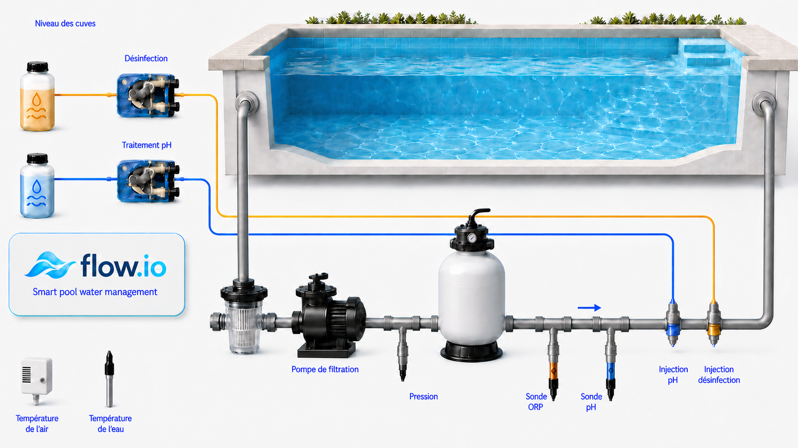
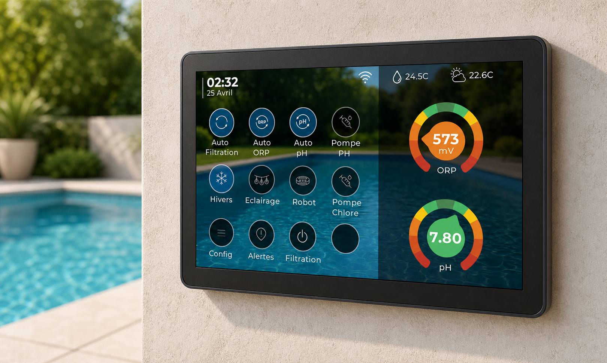
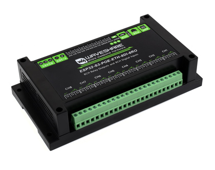
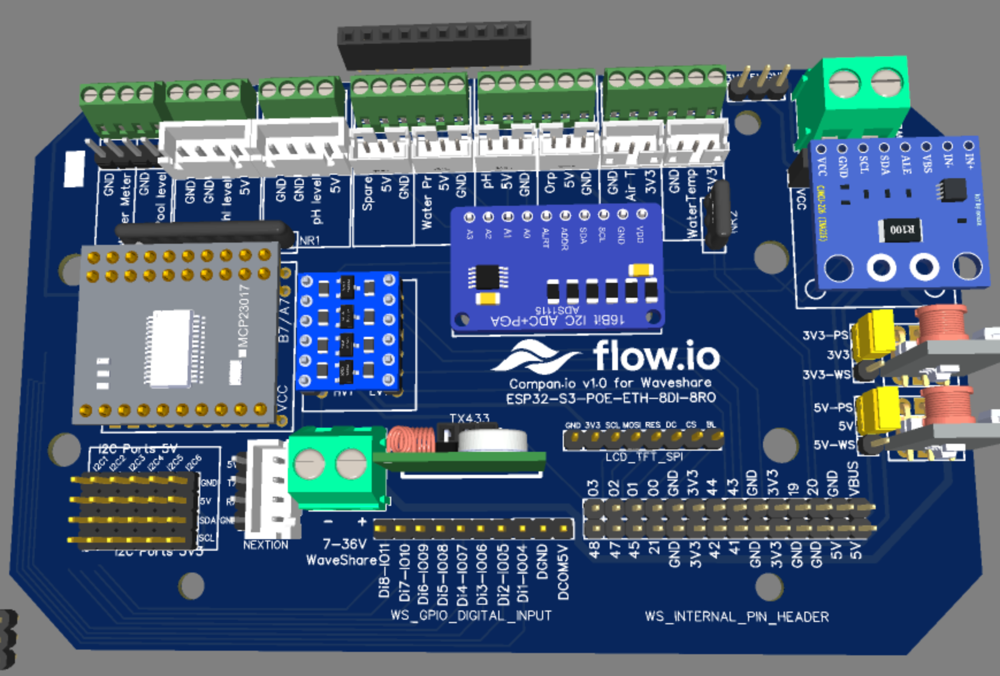

# flow.io

  

  <strong>Le pilotage intelligent et local des équipements de votre piscine.</strong>

flow.io surveille le bassin, automatise les traitements et coordonne les équipements de la piscine depuis un contrôleur unique. L'objectif est simple : conserver une eau stable, éviter les fonctionnements inutiles et rendre l'entretien quotidien plus prévisible.

## Exemple d'installation

   
  <em>Exemple d'installation en cours du système flow.io.</em>

## Ce que flow.io fait pour votre piscine

### Maintenir une eau équilibrée

flow.io suit les principales mesures utiles au traitement de l'eau :

- température de l'eau et de l'air ;
- pH et potentiel redox (ORP) ;
- pression du circuit hydraulique ;
- niveau d'eau du bassin ;
- niveau des cuves de traitement ;
- consommation d'eau et temps de fonctionnement des équipements.

À partir de ces informations et des réglages choisis, flow.io adapte les actions de traitement tout en tenant compte des conditions de sécurité.

### Adapter automatiquement la filtration

La durée de filtration peut évoluer avec la température de l'eau et les horaires autorisés. flow.io coordonne également la filtration avec les traitements, le chauffage, le robot et les autres équipements qui en dépendent.

Les modes automatique, manuel, hivernage et protection contre le gel permettent d'adapter le fonctionnement à la saison et aux besoins ponctuels.

### Piloter le traitement de l'eau

flow.io prend en charge plusieurs stratégies de désinfection :

- dosage de chlore ou de brome à partir de la mesure ORP ;
- électrolyse au sel, selon une consigne ORP ou des plages de fonctionnement ;
- dosage planifié d'oxygène actif liquide selon le volume du bassin et les paramètres du produit.

La correction du pH peut être pilotée avec une pompe doseuse pH− ou pH+. Les injections sont conditionnées par l'état de la filtration, la disponibilité des mesures, la pression hydraulique et les limites de fonctionnement configurées.

### Coordonner les équipements

Selon l'installation, flow.io peut commander :

- la pompe de filtration ;
- les pompes doseuses pH et désinfection ;
- un électrolyseur au sel ;
- le chauffage ou la pompe à chaleur ;
- un robot de piscine ;
- le remplissage automatique ;
- l'éclairage et des relais auxiliaires.

Les dépendances entre équipements sont gérées de manière centralisée. Par exemple, un traitement ou un chauffage qui nécessite une circulation d'eau ne fonctionne pas indépendamment de la filtration.

## Vue d'ensemble

  

Le contrôleur reçoit les mesures du bassin et des cuves, puis commande les équipements de filtration, de traitement et de confort. Les informations restent consultables localement et peuvent également être transmises à une installation domotique.

## Une supervision locale et distante

flow.io propose plusieurs moyens de suivre et de piloter la piscine :

- une interface web adaptée à l'ordinateur et au téléphone ;
- un écran tactile local pour les mesures et commandes essentielles ;
- une intégration MQTT et Home Assistant ;
- des historiques et tableaux de bord possibles avec les outils compatibles MQTT ;
- des alarmes pour les états qui nécessitent une intervention ;
- des mises à jour du système par le réseau local.

  

## Le matériel flow.io

L'installation de référence associe un contrôleur industriel Waveshare ESP32-S3 à la carte flow.io Companion.

<table>
  <tr>
    <td align="center" width="40%">
       
      <strong>Contrôleur Waveshare</strong>
    </td>
    <td align="center" width="60%">
       
      <strong>Carte flow.io Companion</strong>
    </td>
  </tr>
</table>

Le contrôleur [Waveshare ESP32-S3-POE-ETH-8DI-8RO](https://www.waveshare.com/product/iot-communication/esp32-s3-eth-8di-8ro.htm) assure le fonctionnement autonome et les communications Ethernet ou Wi-Fi.

La carte flow.io Companion regroupe les raccordements utiles à la piscine sur des borniers et connecteurs clairement identifiés : sondes pH et ORP, pression, températures, niveaux, compteur d'eau, afficheur et extensions. Elle simplifie le câblage et permet une intégration plus compacte et plus lisible dans le coffret technique.

## Au quotidien

Une fois l'installation configurée, flow.io travaille en continu pour :

- ajuster la filtration aux conditions du bassin ;
- maintenir les traitements dans les plages choisies ;
- empêcher certaines commandes lorsque les conditions de sécurité ne sont pas réunies ;
- signaler les niveaux bas, les défauts de pression ou les mesures indisponibles ;
- conserver les temps de marche et les volumes injectés ;
- donner une vue d'ensemble de la piscine, sur place ou à distance.

Le résultat recherché est une eau plus régulière, moins d'interventions répétitives et une meilleure maîtrise des consommations de produits et d'énergie.

---

Pour l'installation, la compilation, la cartographie des raccordements et la structure du logiciel, consulter la [documentation technique de flow.io](docs/README.md).
