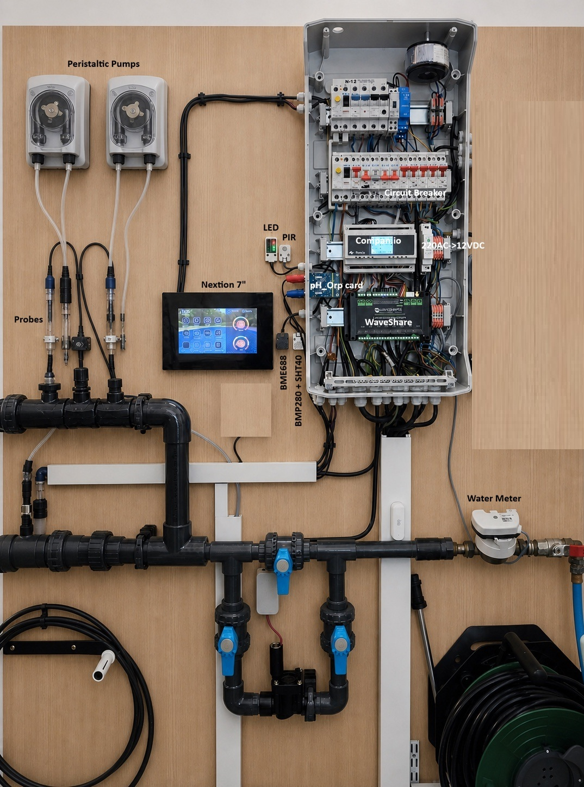

# Matériel flow.io

Cette section décrit l'installation matérielle de référence construite autour du contrôleur Waveshare ESP32-S3-ETH-8DI-8RO et de la carte Flow.io Companion v1.1. Elle sépare volontairement le choix des composants, la fabrication, l'assemblage et le raccordement au firmware.

## Parcours recommandé

1. choisir le [contrôleur Waveshare](waveshare-controller.md) et son mode d'alimentation ;
2. préparer la [nomenclature générale](bill-of-materials.md) ;
3. commander ou fabriquer la [Companion v1.1](companion-v1.1.md) ;
4. suivre le [guide d'assemblage de la Companion](companion-assembly.md) ;
5. intégrer, si nécessaire, le [boîtier DIN et le TFT local](enclosures-and-local-tft.md) ;
6. installer un [écran Nextion](nextion-displays.md) et/ou les [capteurs et extensions](sensors-and-extensions.md) ;
7. choisir l'[interface pH/ORP](ph-orp-interface.md) ;
8. terminer par la [mise en service du firmware](../integration/mise-en-service.md).

## Composition du système

| Sous-ensemble | Rôle | Statut |
|---|---|---|
| Waveshare ESP32-S3-ETH-8DI-8RO | calcul, réseau, relais, entrées isolées et alimentation | requis |
| Flow.io Companion v1.1 | adaptation et distribution des signaux vers les capteurs et interfaces | requis pour l'installation documentée |
| ADS1115 16 bits | acquisition analogique pH, ORP, pression et voie libre | requis |
| INA226 | mesure de tension, courant et puissance | requis pour la configuration de référence |
| DS18B20 eau et air | températures OneWire | requis pour les fonctions de référence |
| Nextion | interface tactile locale | recommandé |
| TFT ST7789 240×320 | affichage local intégré au boîtier Companion | optionnel |
| MCP23017 | entrées et sorties supplémentaires | recommandé |
| PIR, ENV-IV, ENV-Pro, LED, Venice | extensions locales | optionnel |
| Adaptateurs pH/ORP | conditionnement et isolation des sondes | requis si les fonctions de régulation pH/ORP sont utilisées |

## Source de vérité

- Les broches, adresses I2C et affectations logiques sont définies par la [cartographie IO](../core/waveshare-io-map.md).
- Les versions des fichiers de fabrication et leurs sommes SHA-256 sont dans [`hardware/catalog.yaml`](../../hardware/catalog.yaml).
- Les achats et composants sont décrits par les [BOM CSV](../../hardware/bom/).
- Le protocole de l'écran tactile est documenté séparément dans [ESP / Nextion](../integration/nextion-esp-protocol.md).

Une mention **(À confirmer)** indique une information absente ou ambiguë dans les sources disponibles. Elle ne doit pas être interprétée comme une valeur par défaut.

## Sécurité

> Les relais et alimentations peuvent être raccordés au secteur. Couper, condamner et vérifier l'absence de tension avant toute intervention. Le raccordement secteur, la protection contre les surintensités, la section des conducteurs, la mise à la terre et l'enveloppe doivent être définis par une personne qualifiée selon les règles applicables à l'installation.

Les essais initiaux doivent être réalisés sans charge secteur : contrôler d'abord les continuités, l'absence de court-circuit, les polarités et les tensions 3,3 V / 5 V, puis tester les entrées et relais avec des circuits adaptés.
