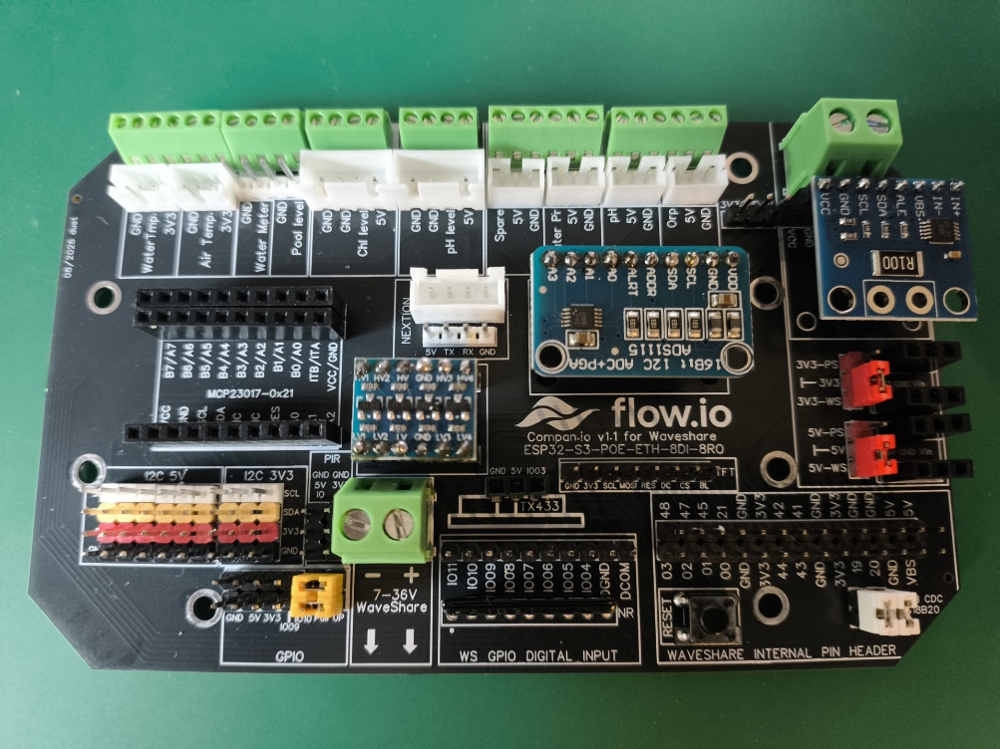
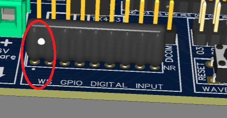
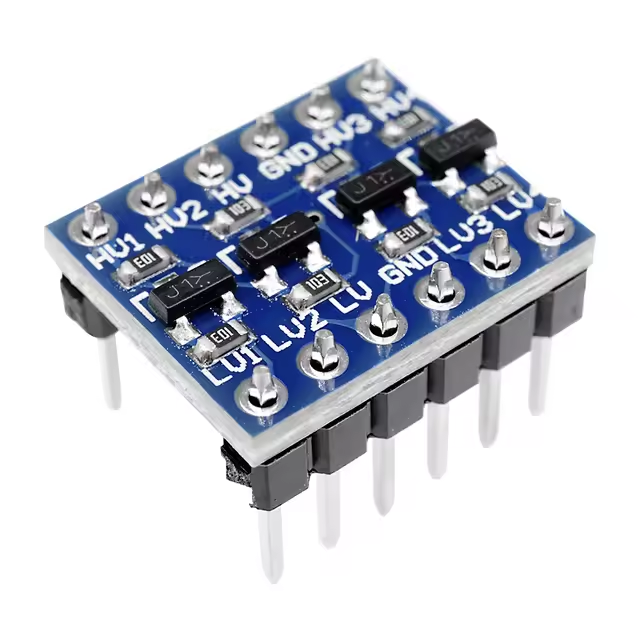
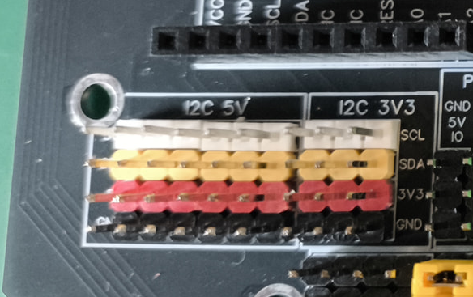
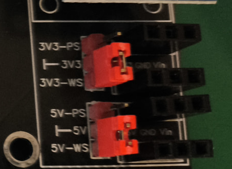
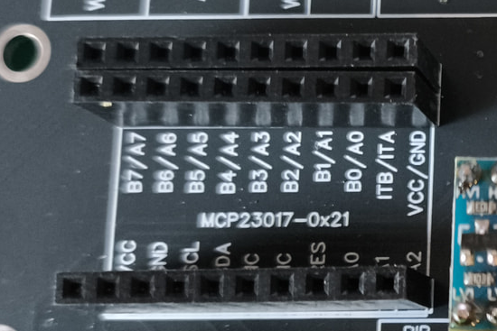
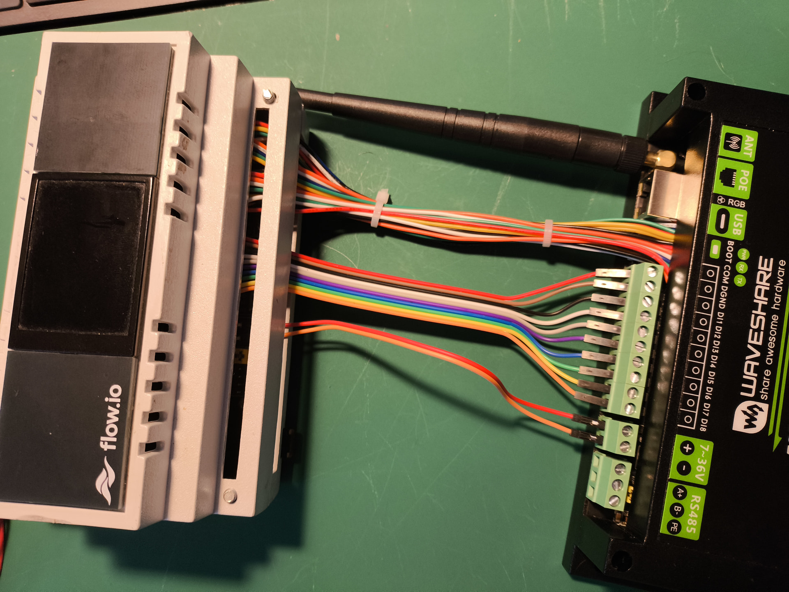
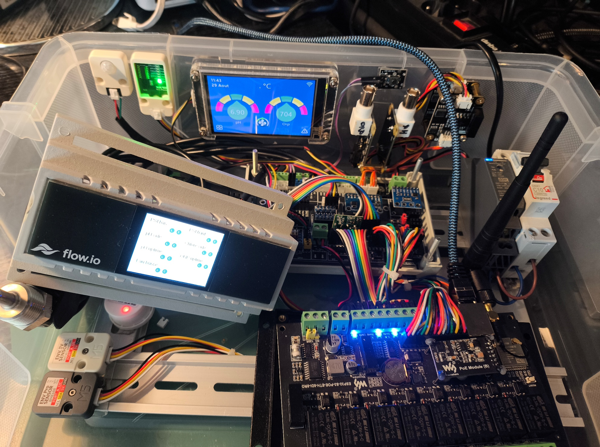

# Assemblage de la Companion v1.1

Préparer les composants de la [BOM Companion](../../hardware/bom/companion-v1.1.csv) avant de commencer. Les étapes ci-dessous insistent sur les orientations et les raccordements qui ne sont pas évidents sur la sérigraphie.

## 1. Contrôler le PCB et les composants

- comparer la révision du PCB avec `v1.1` ;
- inspecter les pistes, trous métallisés et courts-circuits visibles ;
- identifier séparément les connecteurs mâles, femelles et les différents pas ;
- confirmer que le convertisseur analogique est un ADS1115 16 bits ;
- repérer la broche commune du réseau de résistances.

## 2. Réseau de résistances

Le réseau `NR` est polarisé par sa broche commune. Faire coïncider le point du composant avec le repère de la sérigraphie.

Une inversion relie les résistances aux mauvaises lignes et ne peut pas être corrigée par la configuration logicielle.

## 3. Convertisseur de niveau I2C

Le sens du convertisseur est impératif : `HV` correspond au côté 5 V et `LV` au côté 3,3 V.

Vérifier la sérigraphie réelle du module acheté ; l'ordre des broches varie selon les fabricants. Ne pas se baser uniquement sur sa forme.

## 4. Connecteurs et couleurs

L'utilisation de couleurs constantes facilite le diagnostic, en particulier sur les bus I2C. La photo de référence distingue les rangées 5 V et 3,3 V.

Les couleurs sont une aide visuelle, pas une définition électrique. Contrôler GND, alimentation, SDA et SCL par continuité.

## 5. Cavaliers d'alimentation

Pour utiliser les régulateurs du Waveshare, placer les cavaliers sur `5V-5V_WS` et `3V3-3V3_WS`.

Si des convertisseurs DC-DC sont ajoutés, déplacer les cavaliers vers `5V-5V_PS` et `3V3-3V3_PS` après avoir contrôlé leurs tensions à vide. Les deux sources d'un même rail ne doivent jamais être pontées.

## 6. MCP23017

Installer le MCP23017 dans le bon sens sur son support et vérifier son adresse `0x21`. Des broches suffisamment longues peuvent faciliter la connexion d'extensions futures.

## 7. Modules enfichables

Monter puis contrôler :

- l'ADS1115 16 bits ;
- l'INA226 ;
- le convertisseur de niveau I2C ;
- les éventuels convertisseurs DC-DC ;
- les cavaliers requis par la configuration choisie.

Avant d'insérer un module, comparer sa sérigraphie à celle du PCB. Les modules génériques peuvent inverser VCC, GND, SDA et SCL.

## 8. Liaison avec le Waveshare

La liaison utilise quatre nappes femelle-femelle de 7 conducteurs et une nappe mâle-femelle de 10 conducteurs. Les groupes de 7 broches sont disposés en miroir pour réduire les croisements ; suivre les numéros sérigraphiés.

Une nappe 2×5 peut remplacer la nappe 1×10 pour obtenir une connexion plus robuste, sous réserve de vérifier la correspondance broche à broche.

## 9. Contrôles avant alimentation

1. retirer les modules enfichables sensibles ;
2. vérifier qu'aucun rail d'alimentation n'est en court-circuit avec GND ;
3. contrôler chaque conducteur des nappes ;
4. alimenter sans charge et mesurer 3,3 V puis 5 V ;
5. couper l'alimentation, insérer les modules et recommencer les mesures ;
6. lancer un scan I2C et comparer les adresses à la [topologie attendue](../core/waveshare-io-map.md#topologie-matérielle).

