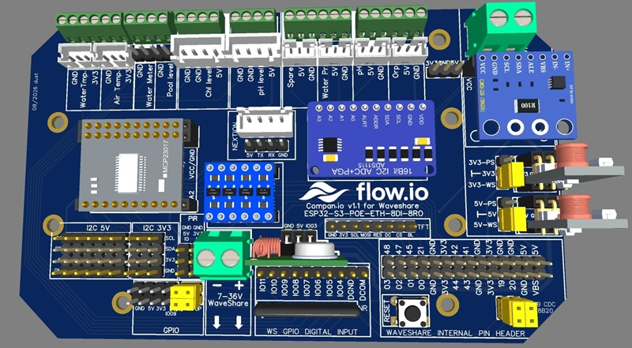
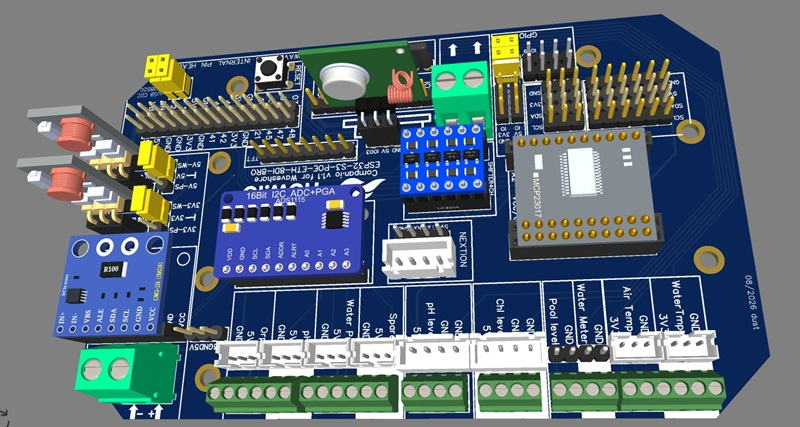
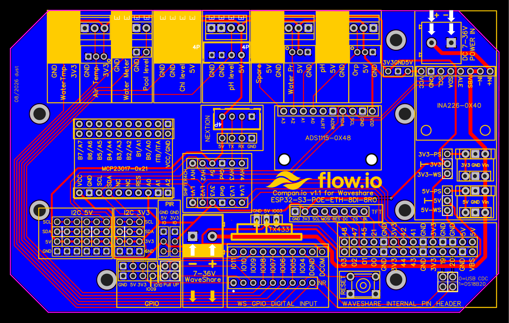

# Carte Flow.io Companion v1.1

La Companion v1.1 adapte le connecteur d'extension du contrôleur Waveshare aux fonctions d'une installation de piscine. Elle regroupe les connecteurs des sondes, des capteurs de niveau, du compteur d'eau, des interfaces analogiques, de l'affichage et des extensions I2C.

## Fonctions intégrées

| Fonction | Composant ou interface |
|---|---|
| pH, ORP, pression et voie analogique libre | ADS1115 interne `0x48` |
| tension, courant et puissance | INA226 `0x40` |
| adaptation I2C | convertisseur bidirectionnel 5 V / 3,3 V |
| température eau | DS18B20 sur GPIO20 |
| température air | DS18B20 sur GPIO19 |
| niveaux, compteur d'eau et PIR | GPIO5 à GPIO11 selon la cartographie IO |
| entrées/sorties supplémentaires | MCP23017 `0x21` |
| écran tactile | connecteur Nextion UART2 |
| affichage local | connecteur TFT ST7789 SPI |
| extensions | bus I2C 5 V et 3,3 V, GPIO9 et GPIO10 disponibles |

## Alimentation

La Companion peut utiliser les rails régulés du Waveshare :

- cavalier `5V-5V_WS` pour le rail 5 V ;
- cavalier `3V3-3V3_WS` pour le rail 3,3 V.

Si la charge des extensions devient trop importante, deux convertisseurs DC-DC optionnels peuvent alimenter les rails séparément :

- cavalier `5V-5V_PS` pour le convertisseur 5 V ;
- cavalier `3V3-3V3_PS` pour le convertisseur 3,3 V.

Ne jamais relier simultanément une même sortie `_WS` et `_PS`. La référence exacte, le courant continu disponible et le réglage des convertisseurs installés sont **(À confirmer)** avant de déplacer les cavaliers.

## MCP23017

Le support MCP23017 est prévu à l'adresse `0x21`. Le firmware expose GPA0 à GPA6 comme entrées et GPB0 à GPB7 comme sorties. Le montage de l'expander dès l'assemblage initial est recommandé, même si ses ports ne sont pas immédiatement utilisés.

## Fichiers de fabrication

| Ressource | Fichier |
|---|---|
| Source EasyEDA | [`EasyEDA_PCB_...json`](../../hardware/companion/v1.1/EasyEDA_PCB_Flowio_Companion_Waveshare-ESP32-S3-POE-ETH-8DI-8RO-1.1_2026-08-11.json) |
| Gerber et perçages | [`Gerber_...zip`](../../hardware/companion/v1.1/Gerber_ESP32-S3_Flowio_Companion_Waveshare-ESP32-S3-POE-ETH-8DI-8RO-1.1_2026-08-11.zip) |
| Modèle 3D OBJ | [`OBJ_...zip`](../../hardware/companion/v1.1/OBJ_Flowio_Companion_Waveshare-ESP32-S3-POE-ETH-8DI-8RO-1.1_2026-08-11.zip) |
| BOM normalisée | [`companion-v1.1.csv`](../../hardware/bom/companion-v1.1.csv) |
| Empreintes SHA-256 | [`hardware/catalog.yaml`](../../hardware/catalog.yaml) |

Les Gerber correspondent à la révision v1.1 datée du 11 août 2026. Les paramètres de fabrication — épaisseur, cuivre, finition, couleur du masque et quantité — sont **(À confirmer)** auprès du fabricant avant commande.

## Suite

- [Assembler la Companion](companion-assembly.md)
- [Monter la Companion et le TFT dans un boîtier DIN](enclosures-and-local-tft.md)
- [Raccorder et vérifier le profil Waveshare](../integration/mise-en-service.md)
