# Boîtier DIN, façade et TFT local

La configuration illustrée utilise un boîtier DIN RS PRO référence `1862291`, donné dans la source pour `138,8 × 88,8 × 62,8 mm`. La disponibilité actuelle de cette référence est **(À confirmer)**. Le TFT local est un module ST7789 240×320 de 2 pouces avec cadre métallique.

> Les opérations de découpe, perçage et collage sont irréversibles. Tester le TFT et présenter toutes les pièces à blanc avant de modifier le boîtier.

## Matériel

- boîtier DIN et deux plaques de fermeture ;
- TFT ST7789 240×320, 2 pouces, avec cadre métallique ;
- nappe Dupont 8 broches femelle-femelle, 2,54 mm, environ 10 cm ;
- façade Flow.io ;
- colle compatible avec l'ABS et les matériaux du TFT **(À confirmer)** ;
- quatre vis ou boulons M4 × 40 mm et leurs écrous ;
- PIR miniature optionnel ;
- outillage de perçage, lame fine non conductrice et matériel de protection.

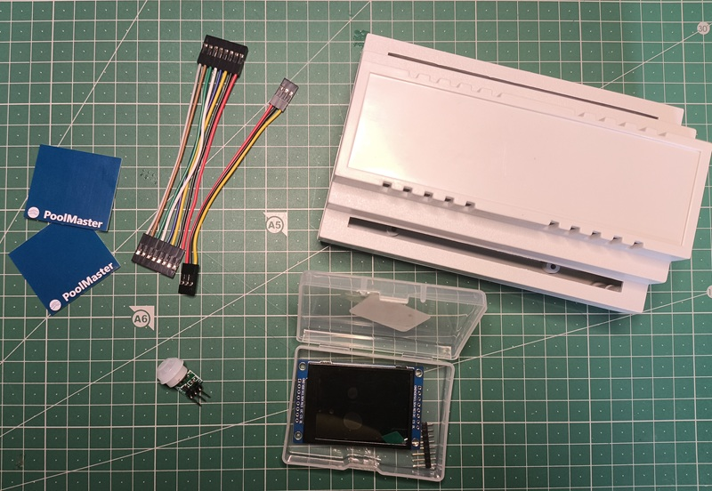

## 1. Préparer la nappe TFT

La procédure source inverse les conducteurs rouge et noir de la nappe 8 broches.

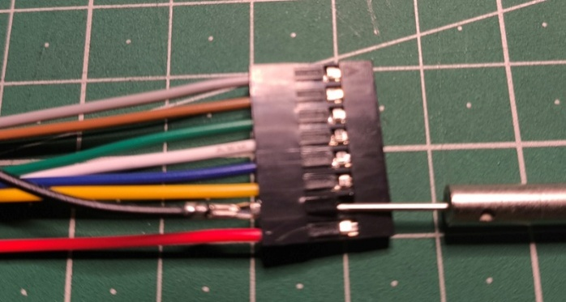

Cette couleur n'est pas une garantie de polarité. Identifier les broches par continuité et vérifier le brochage suivant, défini par le firmware :

| Signal | GPIO |
|---|---:|
| Backlight | 21 |
| CS | 45 |
| DC | 1 |
| RST | 47 |
| MOSI | 2 |
| SCLK | 48 |
| MISO | non raccordé |

La tension d'alimentation et l'ordre exact des huit broches du module acheté sont **(À confirmer)** à partir de sa sérigraphie.

## 2. Séparer l'écran de son PCB

Retirer délicatement le cadre métallique sans enlever le film de protection de la dalle. Déverrouiller le connecteur de la nappe flexible avec un outil non métallique, puis séparer progressivement la dalle et le PCB à l'aide d'une lame fine.

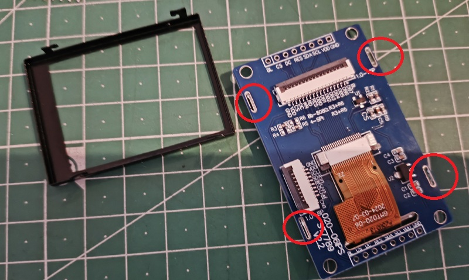

Ne pas tirer sur la nappe flexible et ne pas exercer de pression localisée sur la dalle.

## 3. Percer le boîtier

La procédure de référence place le centre du trou à environ 35 mm du bord gauche et utilise un diamètre de 24 mm.

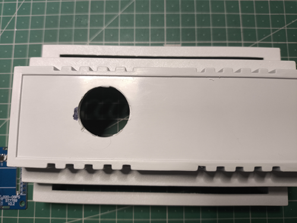

Ces cotes correspondent au boîtier et au TFT illustrés. Les reporter sur les pièces réellement achetées avant perçage.

## 4. Préparer et fixer le PCB du TFT

Souder une barrette 8 broches comme sur le montage de référence.

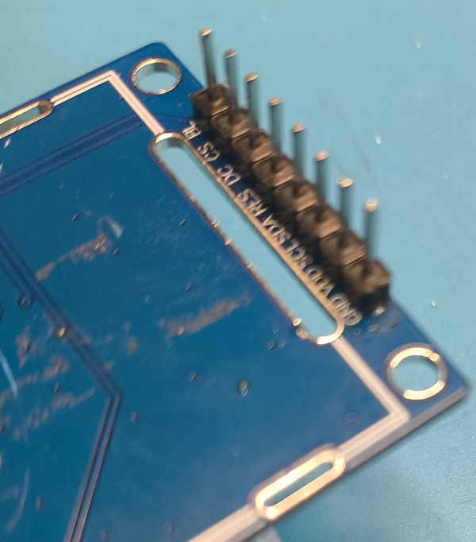

Présenter le PCB derrière le trou, vérifier le passage de la nappe et la fermeture du boîtier, puis coller le PCB.

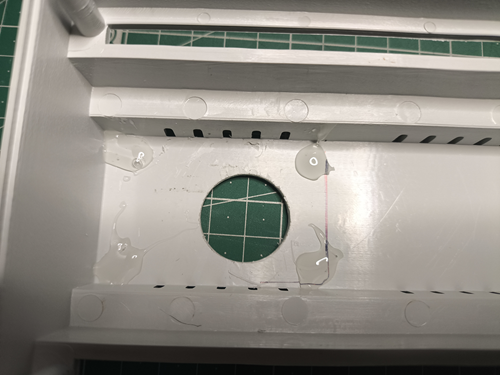

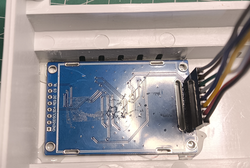

Maintenir l'assemblage pendant le temps de polymérisation prescrit par la colle. La procédure source utilisait une pression maintenue pendant 24 heures.

## 5. Reposer la dalle

Réassembler la dalle et son cadre, insérer puis verrouiller la nappe flexible, et effectuer un essai avant collage définitif.

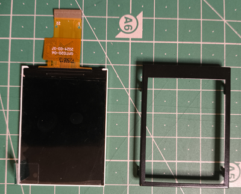

Centrer ensuite l'écran dans l'ouverture et maintenir l'ensemble pendant la prise de la colle.

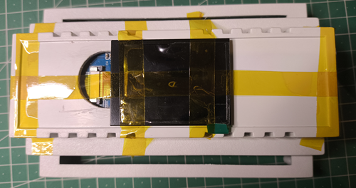

## 6. Ajouter le PIR interne — optionnel

Le PIR interne est une alternative au module externe avec boîtier. Préparer une nappe 3 broches et contrôler sa polarité ; une inversion d'alimentation peut détruire le détecteur.

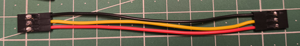

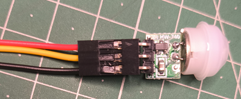

Percer une plaque latérale, retirer temporairement la lentille si nécessaire, puis fixer le capteur. Dans la procédure illustrée, l'orientation de la plaque masque le logo ; l'orientation finale est **(À confirmer)** selon la façade choisie.

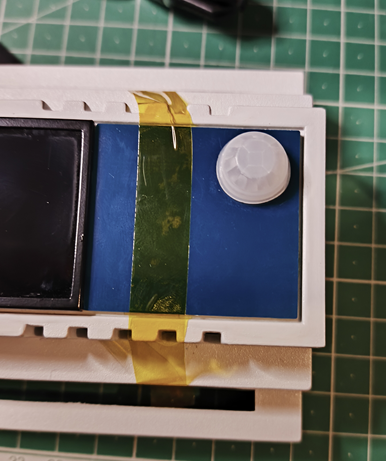

Le signal est lu sur GPIO11, actif haut, via l'entrée logique PIR du firmware.

## 7. Fermeture et maintenance

Remplacer les vis difficiles d'accès par quatre fixations M4 × 40 mm afin de pouvoir ouvrir le boîtier lorsqu'il est monté sur son support. La combinaison exacte vis, écrous et entretoises est **(À confirmer)** pour le boîtier réellement utilisé.

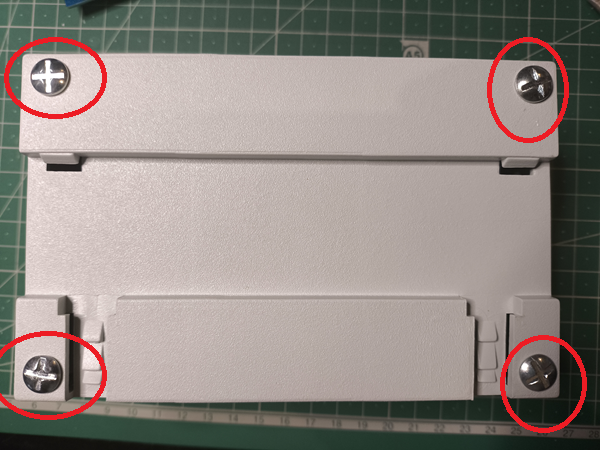

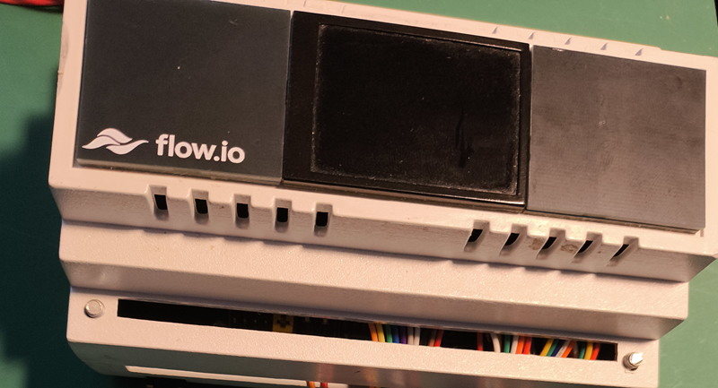

## Façade Flow.io

Les ressources disponibles sont :

- [source EasyEDA](../../hardware/companion/facade/EasyEDA_PCB_FLOWIO_DIN_FACADE_2026-08-11.json) ;
- [paquet de fabrication d'origine](../../hardware/companion/facade/PCB_FLOWIO_DIN_FACADE__20260616163521.zip_Y25.zip) ;
- [empreinte SHA-256](../../hardware/catalog.yaml).

La révision fonctionnelle de cette façade et les paramètres du paquet fabricant sont **(À confirmer)** ; contrôler les dimensions avant commande.
