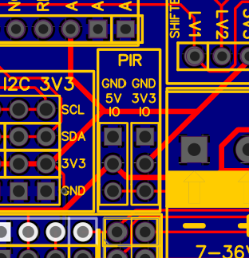
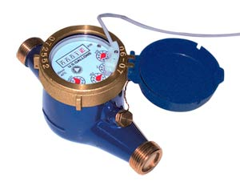
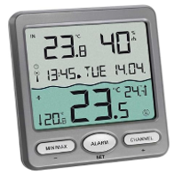
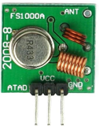
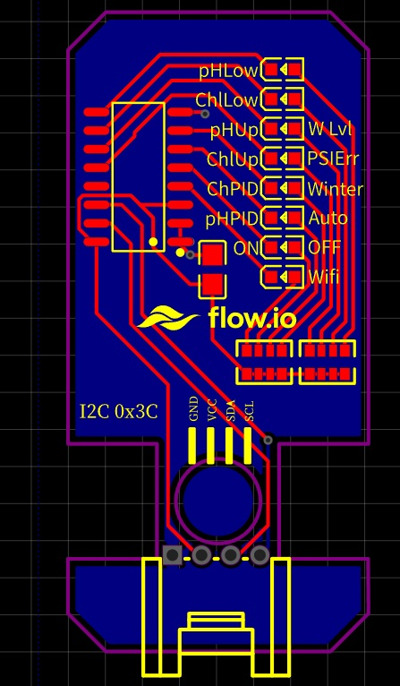
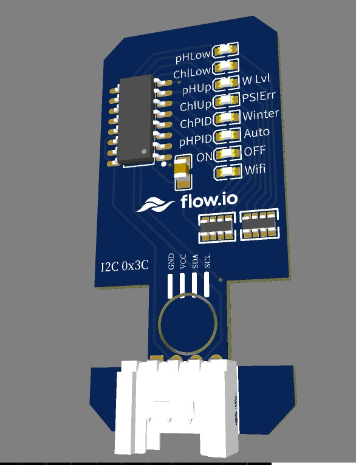
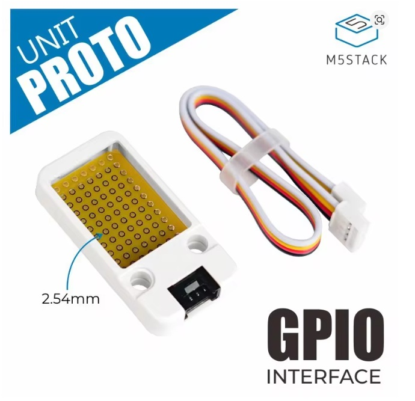

# Capteurs et extensions

Les extensions suivantes disposent d'un support dans le profil Waveshare. Une présence dans cette page ne signifie pas qu'elles sont toutes installées ni affectées par défaut à un rôle métier.

## Matrice de compatibilité

| Extension | Interface | Adresse ou GPIO | État dans flow.io |
|---|---|---|---|
| PIR | numérique actif haut | GPIO11, `i08` | affecté au rôle PIR par défaut |
| M5Stack ENV-IV | I2C | SHT40 `0x44`, BMP280 `0x76` | drivers disponibles, bindings sélectionnables |
| M5Stack ENV-Pro / BME688 | I2C | `0x77` | driver disponible, bindings sélectionnables |
| compteur d'eau à impulsions | entrée numérique | GPIO5, `i12` | compteur actif bas, front montant, debounce 100 ms |
| TFA Venice | RF 433 MHz | émetteur sur GPIO3 | driver disponible, désactivé par défaut |
| panneau Flow.io LED | I2C | PCF8574A `0x3C` | driver dédié, sorties actives bas |
| MCP23017 | I2C | `0x21` | GPA0..GPA6 entrées, GPB0..GPB7 sorties |
| TFT local | SPI | GPIO1, 2, 21, 45, 47, 48 | actif dans le build de production |

Les adresses et bindings complets sont détaillés dans la [cartographie IO](../core/waveshare-io-map.md).

## PIR

Le module externe recommandé est un [M5Stack PIR](https://shop.m5stack.com/products/pir-module) ou un module compatible. Sélectionner sa tension d'alimentation conformément à sa fiche technique ; la tension des alternatives génériques est **(À confirmer)**.

Le signal utilisé par flow.io est actif haut sur GPIO11. Le même endpoint logique peut réveiller le TFT local et le Nextion.

## ENV-IV : SHT40 et BMP280

Le [M5Stack ENV-IV](https://docs.m5stack.com/en/unit/Unit_ENV-IV) regroupe :

- un SHT40 à l'adresse `0x44` pour la température et l'humidité ;
- un BMP280 à l'adresse `0x76` pour la température et la pression atmosphérique.

La source d'origine indique un essai concluant avec un câble de 2 m. Cette longueur n'est pas une garantie pour toutes les topologies I2C : contrôler la qualité des fronts, les résistances de pull-up et la fréquence en cas d'erreurs.

Des modules SHT40 et BMP280 séparés peuvent convenir s'ils utilisent les mêmes adresses et des niveaux électriques compatibles.

## ENV-Pro : BME688

Le [M5Stack ENV-Pro](https://docs.m5stack.com/en/unit/ENV%20Pro%20Unit) utilise un BME688 à l'adresse `0x77`. Flow.io expose température, humidité, pression et résistance gaz. Les estimations propriétaires de qualité d'air, d'équivalent CO₂ ou de COV ne font pas partie du driver actuel.

La source d'origine indique également un essai avec un câble de 2 m.

## Compteur d'eau

Tout compteur fournissant une impulsion compatible avec l'entrée peut être utilisé. Il se raccorde à GPIO5 et GND sur la Companion.

Le type de contact, la polarité, l'alimentation éventuelle et le nombre d'impulsions par litre sont **(À confirmer)** pour le compteur choisi. Le coefficient de conversion doit être configuré en conséquence.

## Émetteur TFA Venice

Le driver transmet périodiquement la température d'eau à un afficheur TFA Dostmann Venice compatible. L'émetteur 433 MHz est commandé par GPIO3.

Références de la source : [afficheur Venice](https://www.amazon.fr/dp/B010NSG4V2), [émetteur FS1000A ou compatible](https://fr.aliexpress.com/item/1005009706095391.html). La compatibilité radio des variantes commerciales est **(À confirmer)**.

Activer la fonction dans `hmi/venice/enabled` et définir GPIO3 dans `hmi/venice/tx_gpio`.

## Panneau frontal de LEDs

Le panneau Flow.io reprend les états historiques de PoolMaster et les affiche au moyen d'un PCF8574A à l'adresse `0x3C`. Ses huit sorties sont actives à l'état bas et ce composant n'est pas exposé comme expander IO générique.

Ressources : [BOM](../../hardware/bom/led-panel.csv) et [source EasyEDA](../../hardware/led-panel/EasyEDA_PCB_Led-flowio-m5proto_2026-08-11.json).

La valeur des réseaux de résistances LED et la longueur du câble sont **(À confirmer)**. Activer le panneau avec `hmi/leds/enabled`.

## MCP23017

Le MCP23017 est prévu à `0x21`. Il ajoute sept entrées utilisables `GPA0..GPA6` et huit sorties `GPB0..GPB7`. GPA7 n'est pas exposée par la topologie actuelle.

Éviter toute collision avec un autre périphérique à `0x21`. La présence du composant ne crée pas automatiquement un rôle métier : les IO slots doivent être configurés.

## Pompes péristaltiques

Deux pompes sont nécessaires pour une régulation pH et désinfectant liquide indépendante. Leur tension, débit nominal, compatibilité chimique, tubulure, clapets et mode de commande sont **(À confirmer)**. Ne pas dimensionner les temps d'injection avant de connaître et d'étalonner le débit réel de chaque pompe.
